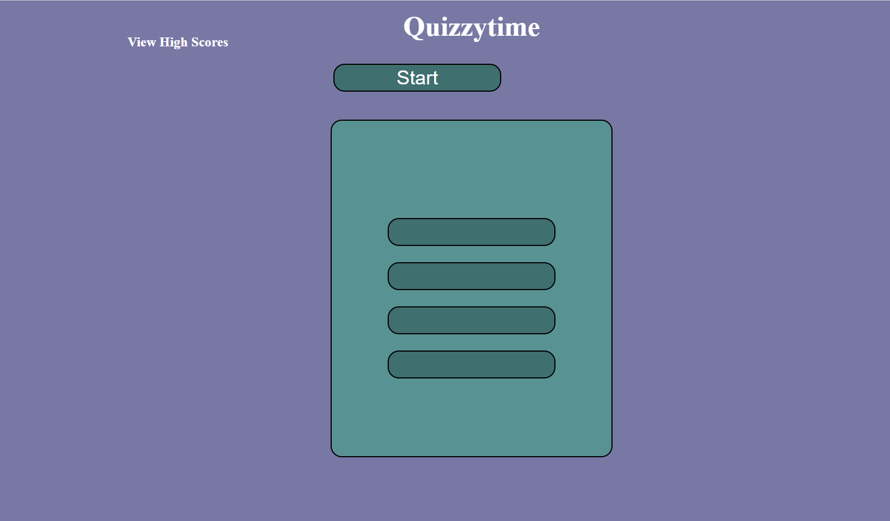

# Quizzytime

I created a quiz that I believe functions as the example. I had help from before hours class TA's, a tutor and ask BCS several times. I am confident that I know what each line of code means and does. 

The start button will start the timer and the quiz questions will pop up.  If you choose the incorrect answer 10 seconds will be subtracted, or if you choose the correct answer you will have it logged and kept for the high score.  You will also get to enter your initials and you can see your score.  